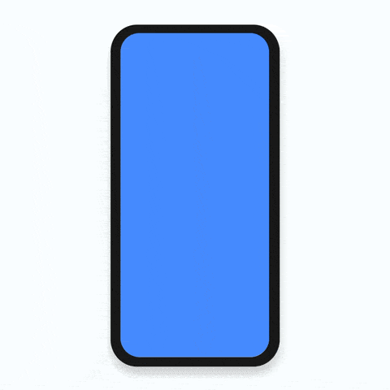

<p align="center">
	<a href="https://apparence.io/">
		
	</a>
</p>
<p align="center">
    
    
    <a href="https://codecov.io/gl/apparence:pal/pal-flutter">
      
    </a>
    <a href="http://doc.pal-plugin.tech/">
      
    </a>
    <a href="http://pal-plugin.tech/">
      
    </a>
</p>

# Pal - The Flutter onboarding editor (beta)

Pal is the onboarding editor dedicated to Flutter apps 📱.

**What does it mean ?**

No code editor for all your app screens directly in your app:
* 🏄‍♂️ Go to a screen where you want to add helper.
* 🎛 Select your helper type.
* 🎨 Select and customize your theme.

## 👀&nbsp; Preview


## 🧐&nbsp; How it works ?

Pal is splitted in two modes:
 * **Editor**, *used to create & manage helpers*.
 * **Client**, *all created helpers was displayed here*.

**Editor mode flow**
1. 🚣‍♂️ Navigate to the screen you want to show your helper.
2. 🚧 Create the helper you want.
3. 🚀 Publish !

**Client mode flow**

1. 📲 Fetch all onboarding on application start.
2. 🎛 Trigger an onboarding each time we detect anything that you configured for.
3. 🙈 Don't show an helper again if user has already seen it.

That's it !

## 🚀&nbsp; Getting started

* Create an **administration** account [**here**](http://demo.pal-plugin.tech).

* Create a **new project** in your dashboard.

* Get your **token** & **save** it for later.


* Add **Pal** dependency
```yaml
dependencies:
  ...
  pal: ^latest_version
```

* Import **Pal** in the ```main.dart```
```dart
import 'package:palplugin/palplugin.dart';
```

* Wrap **your app** with Pal
```dart
void main() => runApp(MyApp());

class MyApp extends StatelessWidget {
  final _navigatorKey = GlobalKey<NavigatorState>();

  @override
  Widget build(BuildContext context) {
    return Pal(
      editorModeEnabled: true,
      appToken: 'REPLACE_WITH_YOUR_APP_TOKEN',
      // --------------------
      // YOUR APP IS HERE
      child: MaterialApp(
        navigatorKey: _navigatorKey,
        navigatorObservers: [PalNavigatorObserver.instance()],
        home: YourApp(),
      ),
      // --------------------
    );
  }  
}
```

## ✨&nbsp; Parameters

| Param | Type  | Description | Required | Default |
| ---   | ---   | ---         | ---      | ---     |
| childApp | ```Widget``` | your application. | ✅ | |
| navigatorKey | ```GlobalKey<NavigatorState>``` | a reference to the navigator key of your application | | ```childApp.navigatorKey``` |
| navigatorObserver | ```PalNavigatorObserver``` | used to manage state of current page | | ```childApp.navigatorObservers``` first entry |
| editorModeEnabled | ```bool``` | enable or Disable the editor mode | | ```true``` |
| textDirection | ```TextDirection``` | text direction of your application | | ```TextDirection.ltr``` |
| appToken | ```String``` | the app token created from the [**admin**](http://demo.pal-plugin.tech) | ✅ | |

## 🎥&nbsp; Gallery

### 😎&nbsp; Client mode


*Some of helpers displayed in the client app*

### 🚧&nbsp; Editor mode

#### 💡&nbsp; Helpers creation


*FullScreen helper*


*Simple box helper*


*Update helper*


*Anchored helper*

### 🎨&nbsp; Edit mode


*Edit an helper*

## 📣&nbsp; Sponsor

<br />

[Initiated and sponsored by Apparence.io.](https://apparence.io)

## ✨&nbsp; More

[📑 Full documentation](http://doc.pal-plugin.tech)

[🌍 Official website](http://pal-plugin.tech)

